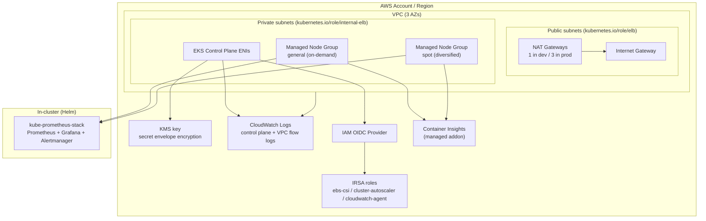

# terraform-aws-eks-platform

Production-ready Amazon EKS platform built from small, composable Terraform modules — VPC, cluster, IRSA, and observability — with cost-tuned dev and resilience-tuned prod environments.

Modular Terraform for a production-ready Amazon EKS platform: a three-AZ VPC, an encrypted and fully logged EKS cluster with on-demand and spot node groups, reusable IAM Roles for Service Accounts (IRSA), and an observability layer built on CloudWatch Container Insights and the Prometheus stack.

The repository is organized as small, composable modules with two root configurations (`dev` and `prod`) that show how the same modules produce differently shaped environments — one tuned for cost, one for resilience.

## Architecture



## Features

- Three-AZ VPC with public/private subnet split, per-AZ route tables, NAT strategy per environment, and VPC flow logs with managed retention
- EKS subnet discovery tags (`kubernetes.io/role/elb`, `kubernetes.io/role/internal-elb`) plus `karpenter.sh/discovery` for future node provisioning
- EKS control plane with KMS envelope encryption of secrets, all five control plane log types, a private endpoint always on, and CIDR-restricted public access
- Managed node groups for on-demand and spot capacity with labels, taints, and autoscaler-friendly `desired_size` handling
- Managed addons (`vpc-cni`, `coredns`, `kube-proxy`, `aws-ebs-csi-driver`) with automatic version resolution and an IRSA role for the EBS CSI driver
- Reusable IRSA module with strict `sub` and `aud` trust conditions, managed and inline policy support, and optional permissions boundaries
- Observability via CloudWatch Container Insights and kube-prometheus-stack, each independently toggleable
- Consistent tagging through a locals-based tag map and `default_tags`, with no hardcoded account IDs anywhere
- CI pipeline covering formatting, validation, TFLint, tfsec, Checkov, and per-environment plans on pull requests

## Modules

| Module | Purpose | Highlights |
|---|---|---|
| [`modules/vpc`](modules/vpc/) | Network foundation | 3-AZ subnets, NAT gateways, flow logs, EKS discovery tags |
| [`modules/eks`](modules/eks/) | Cluster and compute | KMS secret encryption, control plane logging, OIDC provider, on-demand + spot node groups, managed addons |
| [`modules/irsa`](modules/irsa/) | Pod-level IAM | Reusable IAM Roles for Service Accounts with scoped trust policies |
| [`modules/observability`](modules/observability/) | Monitoring | Container Insights addon with IRSA, kube-prometheus-stack via Helm |

## Repository Layout

```
.
├── modules/
│   ├── vpc/
│   ├── eks/
│   ├── irsa/
│   └── observability/
├── environments/
│   ├── dev/        # single NAT, smaller nodes, Prometheus optional
│   └── prod/       # NAT per AZ, larger nodes, full observability
├── .github/workflows/terraform-ci.yml
├── .pre-commit-config.yaml
├── .tflint.hcl
└── Makefile
```

## Prerequisites

- Terraform >= 1.6
- AWS CLI v2 configured with credentials that can create VPC, EKS, IAM, KMS, and CloudWatch resources
- kubectl and helm for post-apply verification
- An S3 bucket and DynamoDB table for remote state (bootstrap commands live in [`environments/dev/backend.tf`](environments/dev/backend.tf))

## Deploying an Environment

1. Bootstrap the state backend once per account, then set the bucket name in `environments/<env>/backend.tf`.

2. Create your variable file:

   ```sh
   cd environments/dev
   cp terraform.tfvars.example terraform.tfvars
   # edit terraform.tfvars — at minimum, narrow cluster_endpoint_allowed_cidrs
   ```

3. Deploy with the Makefile from the repository root:

   ```sh
   make init ENV=dev
   make plan ENV=dev
   make apply ENV=dev
   ```

4. Connect to the cluster:

   ```sh
   aws eks update-kubeconfig --region us-east-1 --name eks-platform-dev
   kubectl get nodes
   ```

Prod follows the same steps with `ENV=prod`. Note two prod-specific guardrails: `cluster_endpoint_allowed_cidrs` rejects `0.0.0.0/0` at plan time, and `grafana_admin_password` is required (set it with `TF_VAR_grafana_admin_password` rather than a file).

To tear an environment down:

```sh
make destroy ENV=dev
```

## Using a Module Directly

Every module stands alone. For example, granting a workload pod-level AWS access from an environment root takes one block:

```hcl
module "app_irsa" {
  source = "../../modules/irsa"

  role_name         = "${module.eks.cluster_name}-orders-api"
  oidc_provider_arn = module.eks.oidc_provider_arn

  service_accounts = [
    { namespace = "orders", name = "orders-api" },
  ]

  policy_arns = ["arn:aws:iam::aws:policy/AmazonSQSReadOnlyAccess"]

  tags = local.tags
}
```

Each module directory contains its own README with full input and output documentation.

## CI

`terraform-ci.yml` runs on pushes to `main` and on pull requests:

- `terraform fmt` check across the repository
- `terraform validate` for every module and environment (matrix, backend disabled)
- TFLint with the AWS ruleset
- tfsec and Checkov static security analysis
- Per-environment `terraform plan` on pull requests, using GitHub OIDC to assume a read-only role (skipped automatically when the `AWS_PLAN_ROLE_ARN` secret is absent, such as on forks)

Local equivalents run through `make fmt-check`, `make lint`, `make security`, and the pre-commit hooks in `.pre-commit-config.yaml`.

## Cost Notes

Rough steady-state estimates for us-east-1 (verify against current pricing before budgeting):

| Item | dev | prod |
|---|---|---|
| EKS control plane | ~$73/mo | ~$73/mo |
| NAT gateways | 1 x ~$33/mo + data | 3 x ~$33/mo + data |
| Nodes (on-demand) | 2 x t3.large ≈ $120/mo | 3 x m6i.large ≈ $210/mo |
| Nodes (spot) | ~60-90% below on-demand | ~60-90% below on-demand |
| Container Insights / logs | low single digits | scales with log volume |
| Prometheus storage (EBS) | off by default | ~110 GiB gp2/gp3 |

The largest levers: `single_nat_gateway` in dev, spot capacity for interruption-tolerant workloads, and CloudWatch log retention (14-30 days in dev, 90 in prod). Destroy dev environments when idle — the control plane bills hourly regardless of workload.

## License

MIT — see [LICENSE](LICENSE). Copyright (c) 2026 Wajahat Uddin Syed.
